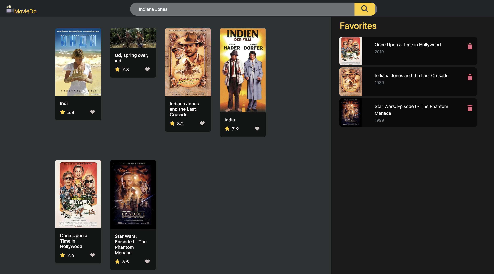
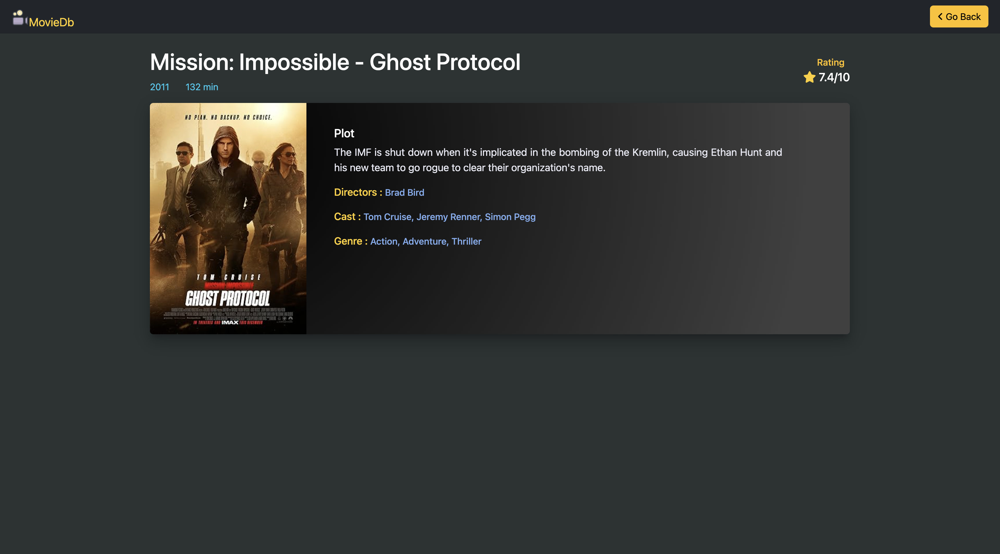

# MovieDb

A mini IMDB clone app in which we can search movies based on OMDB API, with search suggestions. 
Clicking on a particular movie card opens a new movie page for more info.
On clicking on the favourite button, we can add a movie to the favourite list which is using local storage to store movies.  

### Hosted link: https://vk2004.github.io/VAC_Project/

## Tools used:
* HTML
* CSS
* Bootstrap
* JavaScript
* OMDB API
* ASP.NET Framework
